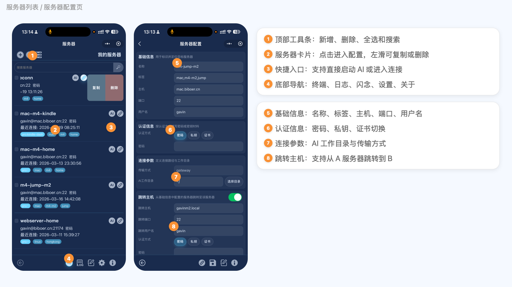
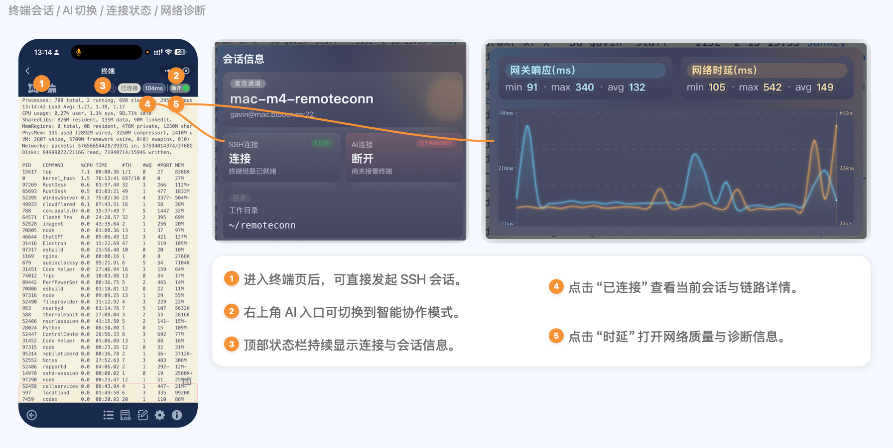
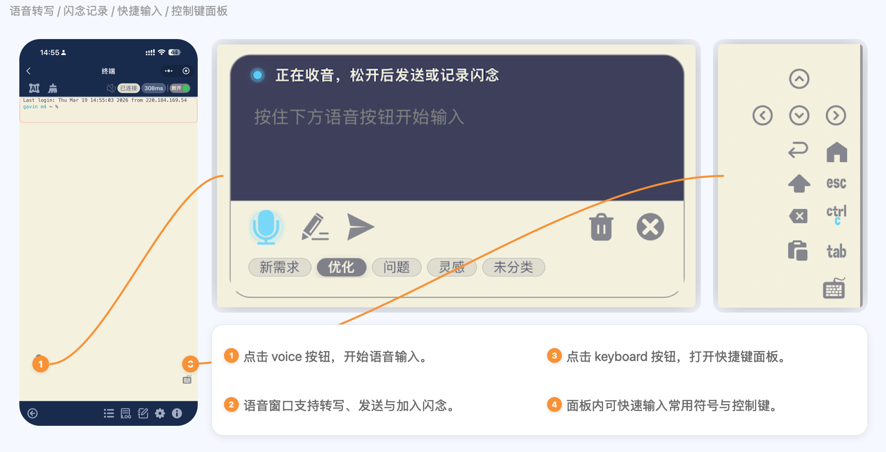
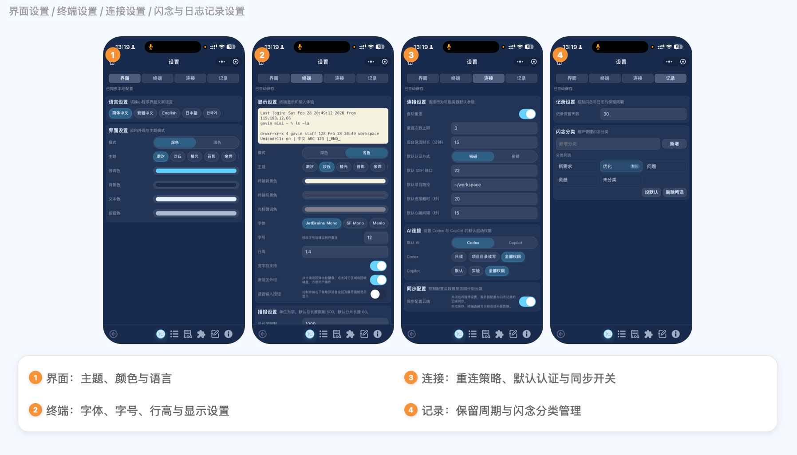
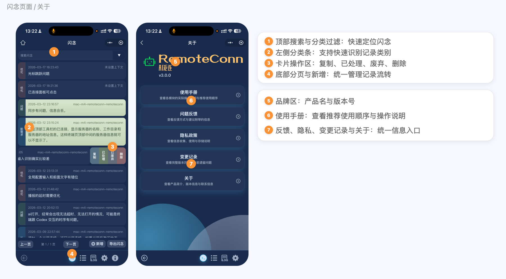

<p align="center">
  
  
</p>

<p align="center">
  
</p>

<p align="center">
  <strong>English</strong> | <a href="./README_cn.md">中文</a>
</p>

# RemoteConn

RemoteConn is a production-oriented remote access workspace built around `shell + chat`. It targets Web, mobile app, and Mini Program entry points, so AI-assisted server work can start from a phone and stay attached to the right project context.

The project focuses on three practical problems:

1. Keep an AI-capable shell available on mobile, not only on desktop IDEs.
2. Use voice input to reduce typing cost on phones.
3. Preserve task context, records, and server bindings so long-running work can continue without handoff friction.

## Monorepo Structure

- `apps/web`: Vue 3 + TypeScript + xterm.js frontend
- `apps/gateway`: Node.js gateway for `WSS -> SSH`
- `packages/shared`: shared models, state machines, Codex orchestration, theme and security helpers
- `packages/plugin-runtime`: plugin runtime with validation, permission control, lifecycle hooks, isolation, and circuit breaking
- `ios/plugin/RemoteConnSSHPlugin`: Capacitor iOS SSH plugin skeleton

## Implemented Capabilities

1. Server and credential management with restricted local storage
2. Terminal session state machine for connect, reconnect, auth pending, and error states
3. Bidirectional gateway forwarding for `init/stdin/stdout/stderr/resize/control`
4. Codex launch orchestration with remote environment checks
5. Session logging and redacted export
6. Theme system with contrast tuning
7. Plugin runtime foundation

## Latest Status

Current README baseline: `v3.0.1` on `2026-03-20`.

Recent milestones:

- `v3.0.1`: Mini Program manual was expanded with image-based guidance, theme presets were aligned with Web to `21` sets, and the project docs were synchronized.
- `v3.0.0`: Terminal interaction stability was improved during Codex output, including caret stability and keyboard-focus handling.
- Cross-device sync currently covers `settings`, `servers`, and `records`. Sensitive server fields remain encrypted as `secret_blob`.

Known limitations still tracked in the project docs:

- Some Mini Program terminal performance issues can still appear during long AI output sessions.
- Voice playback extraction and turn detection are not yet considered stable enough for default use.

For the full Chinese product narrative and detailed historical notes, see [README_cn.md](./README_cn.md), `CHANGELOG.md`, and `release.md`.

## Operation Guide

This guide reuses the five annotated screenshots from the project introduction and keeps the same visual grouping so the main workflow can be understood directly from the README.

For the narrow vertical mobile layout version, see [Mobile Operation Guide](./docs/mobile-operation-guide-2026-03-20.md).

### 1. Server List And Configuration



1. The home page opens on the server list, which is the starting point of the product.
2. The top toolbar is used to add, delete, select, and search servers.
3. The main body of each server card opens the configuration page; the quick actions on the right can duplicate a profile, launch AI, or connect directly.
4. The bottom navigation switches between terminal, logs, records, settings, and about pages.
5. The configuration page is where you fill in the basic connection fields, authentication method, and project directory.
6. `AI Working Directory` defines the default project context for AI startup and is a key part of the collaboration flow.
7. If the target host is reached through a jump host, complete the jump-host fields and its separate authentication settings on the same page.
8. The recommended order is to save the profile first and then start the connection.

### 2. Terminal, AI, And Connection Diagnostics



1. After entering the terminal, you can run shell commands directly or switch to an AI workflow such as `Codex` from the top-left entry.
2. The top status bar continuously shows connection state, latency, and session overview, making it the primary feedback area for mobile troubleshooting.
3. Tapping `Connected` opens the session detail panel with the target host, connection state, and working directory.
4. Tapping `Latency` opens the diagnostics panel so you can inspect gateway response and network latency trends and judge link quality.

### 3. Voice Input And Shortcut Panel



1. The `voice` button at the bottom of the terminal page opens the voice input panel, supporting a "speak first, decide later" input flow.
2. The voice draft can be sent to the terminal directly or saved as a record together with category tags.
3. The `keyboard` button at the bottom opens the shortcut panel to restore terminal control keys that are missing on mobile.
4. The right-side shortcut panel includes arrow keys, `Esc`, `Ctrl+C`, `Tab`, and other high-frequency controls to reduce input friction on phones.

### 4. Settings Center



1. The settings page is grouped into `UI / Terminal / Connection / Records`, covering appearance, terminal behavior, connection policy, and data management.
2. The UI tab controls theme, colors, and language, which shape the overall experience.
3. The terminal tab controls font family, font size, line height, and terminal palette, directly affecting readability and typing efficiency.
4. The connection tab controls default authentication, reconnect strategy, background keepalive, sync switches, and AI defaults.
5. The records tab controls record retention and category management so the information lifecycle stays structured.

### 5. Records And About



1. The records page is used to capture issues, ideas, TODOs, and context fragments.
2. The top area supports search and category filtering so content can be found quickly.
3. Record cards support actions such as copy, mark, and delete.
4. The bottom area provides pagination, add, and export operations.
5. The about page centralizes the brand, version, and product information entry points.
6. It collects the user guide, feedback channel, privacy policy, change log, and about content in one place.
7. Its role is to act as the final landing page for product documentation inside the app, so users can find a consistent explanation without leaving the product.

## Quick Start

```bash
npm install
npm run dev:gateway
npm run dev:web
```

Default endpoints:

- Web: `http://localhost:5173`
- Gateway: `http://localhost:8787`
- Gateway WS: `ws://localhost:8787/ws/terminal`

## Environment Variables

### Gateway

```bash
cp apps/gateway/.env.example apps/gateway/.env
```

Recommended runtime config:

```dotenv
PORT=8787
HOST=0.0.0.0
GATEWAY_TOKEN=replace-with-strong-random-token
CORS_ORIGIN=https://your-domain.com
DEBUG_IO_HEX=0
ASR_INCLUDE_RAW_RESULT=0
ASR_EMPTY_TEXT_WARN_LIMIT=3
```

### Web

```bash
cp apps/web/.env.example apps/web/.env
```

Build-time config:

```dotenv
VITE_GATEWAY_URL=wss://your-domain.com
VITE_GATEWAY_TOKEN=replace-with-strong-random-token
VITE_ENABLE_PLUGIN_RUNTIME=false
```

Notes:

- `VITE_GATEWAY_TOKEN` must match `GATEWAY_TOKEN`.
- `VITE_ENABLE_PLUGIN_RUNTIME=false` is the recommended initial production posture if plugin support is not needed yet.
- If you expose the service through Nginx or Caddy on `443/80`, the internal gateway can still listen on `8787`.

## Quality Commands

```bash
npm run typecheck
npm run lint
npm run test
```

## Gateway Operations

Unified script: `scripts/gatewayctl.sh`

```bash
# First-time deployment
scripts/gatewayctl.sh ensure-env
scripts/gatewayctl.sh install-service $USER
scripts/gatewayctl.sh deploy

# Daily operations
scripts/gatewayctl.sh status
scripts/gatewayctl.sh logs 200
scripts/gatewayctl.sh logs-clear
scripts/gatewayctl.sh restart
scripts/gatewayctl.sh health

# Foreground local run
scripts/gatewayctl.sh run-local
```

- Linux uses `systemd`.
- macOS uses `launchd` at `~/Library/LaunchAgents/com.remoteconn.gateway.plist`.

## Logs

```shell
launchctl print gui/$(id -u)/com.remoteconn.gateway | rg -n "stdout path|stderr path"
tail -f /Users/gavin/Library/Logs/com.remoteconn.gateway.out.log
```

## Benchmarks

Gateway SSH2 baseline:

```bash
npm --workspace @remoteconn/gateway run bench
```

Example with explicit parameters:

```bash
BENCH_SSH_HOST=127.0.0.1 \
BENCH_SSH_PORT=22 \
BENCH_SSH_USER="$USER" \
BENCH_PRIVATE_KEY=~/.ssh/id_ed25519 \
BENCH_ITERATIONS=30 \
BENCH_PAYLOAD_KB=1024 \
npm --workspace @remoteconn/gateway run bench
```

TTYD baseline:

```bash
ttyd -v

BENCH_SSH_HOST=127.0.0.1 \
BENCH_SSH_PORT=22 \
BENCH_SSH_USER="$USER" \
BENCH_SSH_IDENTITY=~/.ssh/id_ed25519 \
BENCH_ITERATIONS=30 \
BENCH_PAYLOAD_KB=1024 \
npm --workspace @remoteconn/gateway run bench:ttyd
```

## Related Documents

- `docs/server-management-ux-iteration-2026-02-25.md`
- `docs/terminal-voice-input-plan-2026-02-26.md`
- `docs/web-storage-layering-guideline-2026-02-25.md`
- `docs/touch-focus-state-machine-plan-2026-02-23.md`
- `CHANGELOG.md`
- `release.md`
